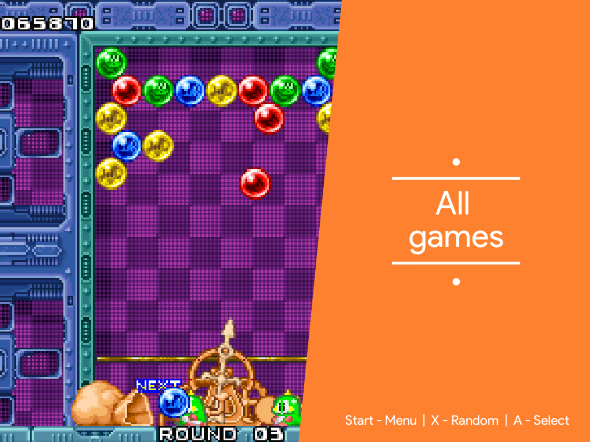

# Angular Theme - Arcade version

A fork of the [Angular theme](https://github.com/lilbud/es-theme-angular) by lilbud, focused on arcade-games only 
using custom collections.

ROM files must be put in the `arcade` folder. Use `opt/retropie/configs/all/emulators.cfg` to override the default emulator
for a specific romname.  

Supported collections are:

* Action
* Beat 'em up'
* Maze
* Platform
* Puzzle
* Racing
* Run 'n' gun
* Sport
* Shoot 'em up
